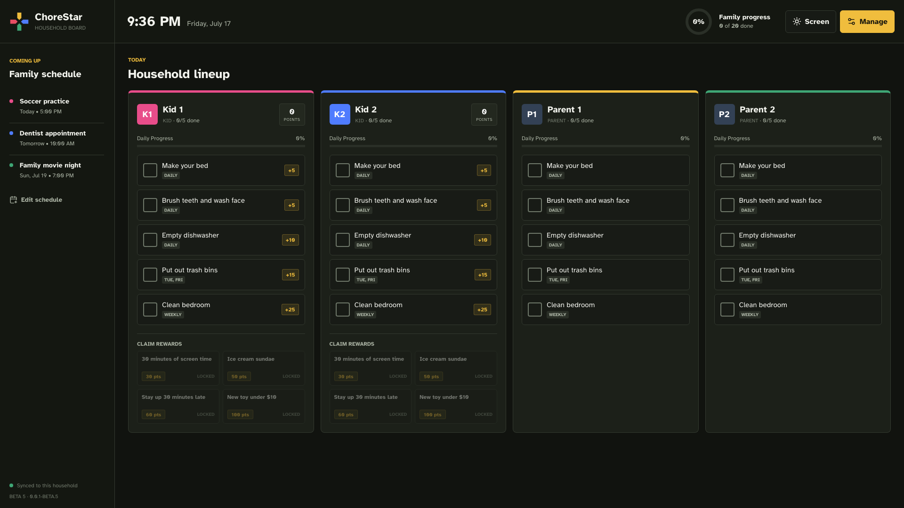
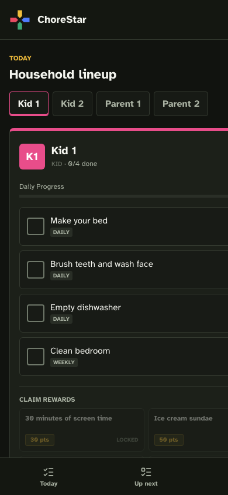
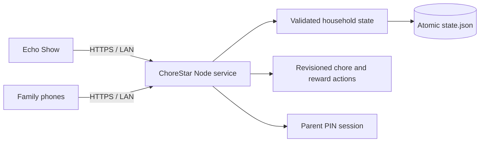

<div align="center">
  
  <h1>ChoreStar</h1>
  <p><strong>A calm, shared household board for chores, schedules, points, and rewards.</strong></p>
  <p>Designed for an Amazon Echo Show 15. Equally useful from a phone.</p>

  <p>
    <a href="https://github.com/notfixingit3/chorestar/actions/workflows/docker-publish.yml"></a>
    <a href="https://github.com/notfixingit3/chorestar/tags"></a>
    <a href="https://github.com/notfixingit3/chorestar/pkgs/container/chorestar"></a>
    
  </p>
</div>



ChoreStar turns a shared screen into an actual household operating surface. Everyone can see what is due, check off their own work, follow the family schedule, and understand the day's progress without opening a phone or navigating a generic productivity app.

It is intentionally self-hosted, touch-friendly, dependency-light, and usable on a private network without relying on public font, icon, or animation CDNs.

## What It Does

| Household workflow | ChoreStar behavior |
| --- | --- |
| **Daily lineup** | Gives each family member a clear lane with large touch targets and visible progress. |
| **Recurring routines** | Supports daily, weekly, and selected-day chore schedules with automatic resets. |
| **Points and rewards** | Awards points when kids finish chores and lets them claim household-defined rewards. |
| **Family schedule** | Keeps the next events visible beside the chore board instead of hiding them in another app. |
| **Parent management** | Manages members, roles, chores, schedules, rewards, points, and reset actions in one workspace. |
| **Shared-device safety** | Protects management actions with a server-verified PIN and an HttpOnly parent session. |
| **Multi-device sync** | Uses server-authoritative mutations and revisions so one device cannot silently overwrite another. |
| **Resilient display** | Bundles its font, icons, and celebration assets and includes a screen wake-lock control. |

## Built For The Room

The Echo Show layout keeps four family members visible at once on a 1920x1080 display. The interface uses solid surfaces, high-legibility type, restrained member colors, and predictable touch targets instead of glass panels or an assistant-style chat shell.

On a phone, ChoreStar switches to one member at a time with direct navigation between the daily lineup, schedule, and management tools.

<p align="center">
  
</p>

## How It Works



- The Node/Express service owns the canonical household state.
- Chore completion and reward claims are validated and applied atomically by the server.
- Administrative saves carry a revision number; stale writes receive the latest state instead of overwriting it.
- Daily and selected-day chores refresh each morning. Weekly chores carry through until Monday.
- State is persisted with a temporary-file-and-rename operation to avoid partial JSON writes.

## Run With Docker

The published image is available from GitHub Container Registry:

```bash
mkdir -p data

docker run -d \
  --name chorestar \
  --restart unless-stopped \
  -p 8282:80 \
  -v "$PWD/data:/app/data" \
  ghcr.io/notfixingit3/chorestar:0.0.1-beta.5
```

Open `http://<docker-host>:8282` and confirm the container is healthy:

```bash
curl -fsS http://127.0.0.1:8282/healthz
```

The image runs as the non-root `node` user. Create the bind-mounted `data` directory as the deployment user before starting the container.

## Deploy On docker1

The production [compose.yml](compose.yml) attaches ChoreStar to the external `groundzero_lan` network and publishes port `8282`.

```bash
ssh house@docker1
cd /opt/stacks/chorestar

mkdir -p data
printf 'CHORESTAR_TAG=0.0.1-beta.5\n' > .env

docker compose pull
docker compose up -d
docker compose ps
curl -fsS http://127.0.0.1:8282/healthz
```

To roll back, change `CHORESTAR_TAG` in `.env` to a previously published version, then run:

```bash
docker compose pull
docker compose up -d
```

## Local Development

Requirements: Node.js 20 or newer.

```bash
git clone https://github.com/notfixingit3/chorestar.git
cd chorestar
npm ci
PORT=8080 npm start
```

Open `http://127.0.0.1:8080`.

Run the API, persistence, concurrency, asset-isolation, and PIN regression suite with:

```bash
npm test
```

Build the same container artifact used by GitHub Actions with:

```bash
docker build -t chorestar:local .
```

## Data And Security

- Runtime data lives in `data/state.json`; mount `/app/data` to persistent storage.
- Existing state files are migrated when read; upgrading does not replace household members or reset their data.
- Legacy plaintext PINs are converted to a salted scrypt hash on the next write.
- The parent PIN is never returned as part of browser state.
- Only the application shell and explicitly allowed bundled assets are publicly served.
- A strict Content Security Policy blocks third-party scripts and inline event handlers.

ChoreStar is designed for a trusted household network. Put it behind HTTPS and access controls before exposing it beyond that network.

## Release Pipeline

Pushes to `dev` run the test suite and publish a development container. Tags matching `v*` publish semver container tags through [GitHub Actions](.github/workflows/docker-publish.yml).

For example, tag `v0.0.1-beta.5` publishes:

```text
ghcr.io/notfixingit3/chorestar:0.0.1-beta.5
```

The application version is read from `package.json` and exposed by both `/healthz` and `/api/state`.

## Project Status

ChoreStar is currently in beta. The core household board, schedules, recurring chores, rewards, synchronization, Docker delivery, and parent controls are functional. The next useful product layers are completion history, optional parent approval for selected chores and rewards, schedule exceptions, and calendar import.
